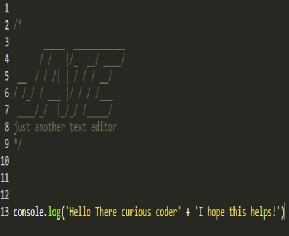

# PWA Text Editor

## Description

This project was created as tool to help with taking notes and to explore the process behind creating a Progressive Web App. As a junior Web Developer I wanted to become familiar with new systems and types of web applications. Through the creation of this app I gained valuable knowledge on webpack configuarations and the process behind Progressive Web Apps.

## Installation

- Copy the files from this git repo and run in whichever software you use
- Then in the cli type "npm install"
- "npm run start"
- "npm run start:dev"
- Then navigate to your localhost:3000/?index
- In the upper left hand corner you should see the install button, click it and you will be prompted with a download
- In the event that doesn't appear click the monitor icon in the address bar and you should be able to download it from there

## Usage

To use the Text Editor simply type into the program as if you were using notepad, except in the case of this app you will see that javascript elements and code snippets will appear as they do in VSCode

## Credits

I created the PWA Text Editor myself so please refer to my github: https://github.com/BrdwrdI

## License

MIT License

Copyright (c) [2024] [WilliamDando]

Permission is hereby granted, free of charge, to any person obtaining a copy
of this software and associated documentation files (the "Software"), to deal
in the Software without restriction, including without limitation the rights
to use, copy, modify, merge, publish, distribute, sublicense, and/or sell
copies of the Software, and to permit persons to whom the Software is
furnished to do so, subject to the following conditions:

The above copyright notice and this permission notice shall be included in all
copies or substantial portions of the Software.

THE SOFTWARE IS PROVIDED "AS IS", WITHOUT WARRANTY OF ANY KIND, EXPRESS OR
IMPLIED, INCLUDING BUT NOT LIMITED TO THE WARRANTIES OF MERCHANTABILITY,
FITNESS FOR A PARTICULAR PURPOSE AND NONINFRINGEMENT. IN NO EVENT SHALL THE
AUTHORS OR COPYRIGHT HOLDERS BE LIABLE FOR ANY CLAIM, DAMAGES OR OTHER
LIABILITY, WHETHER IN AN ACTION OF CONTRACT, TORT OR OTHERWISE, ARISING FROM,
OUT OF OR IN CONNECTION WITH THE SOFTWARE OR THE USE OR OTHER DEALINGS IN THE
SOFTWARE.
